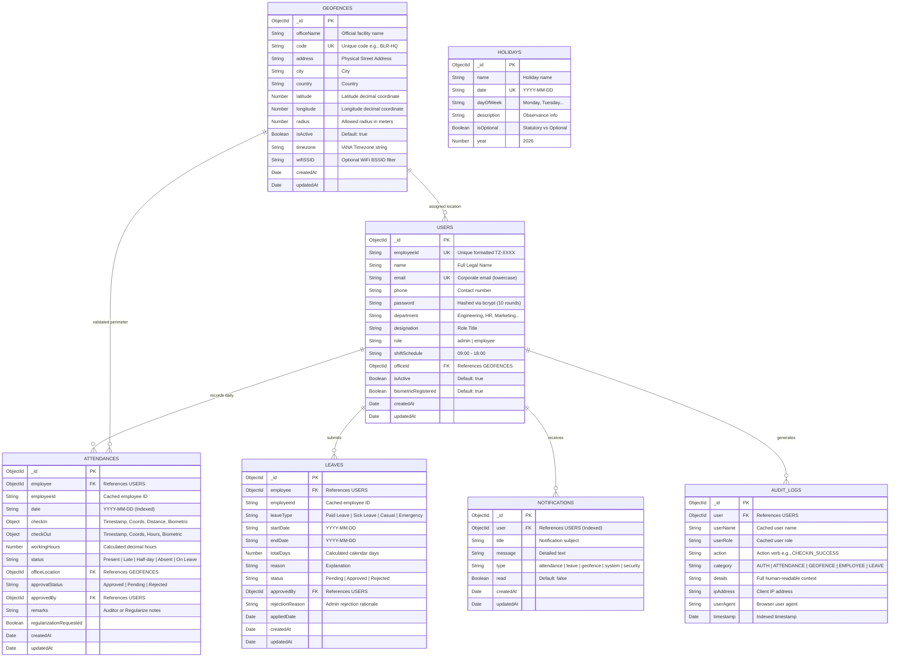

# 📊 TrackZone Database Schema & Architecture

## Overview
TrackZone utilizes MongoDB Document collections managed through Mongoose schemas, featuring indexes, compound unique constraints, and referential integrity.

---

## 1. Complete Entity Relationship Diagram

