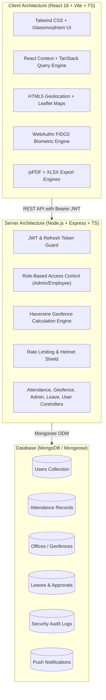
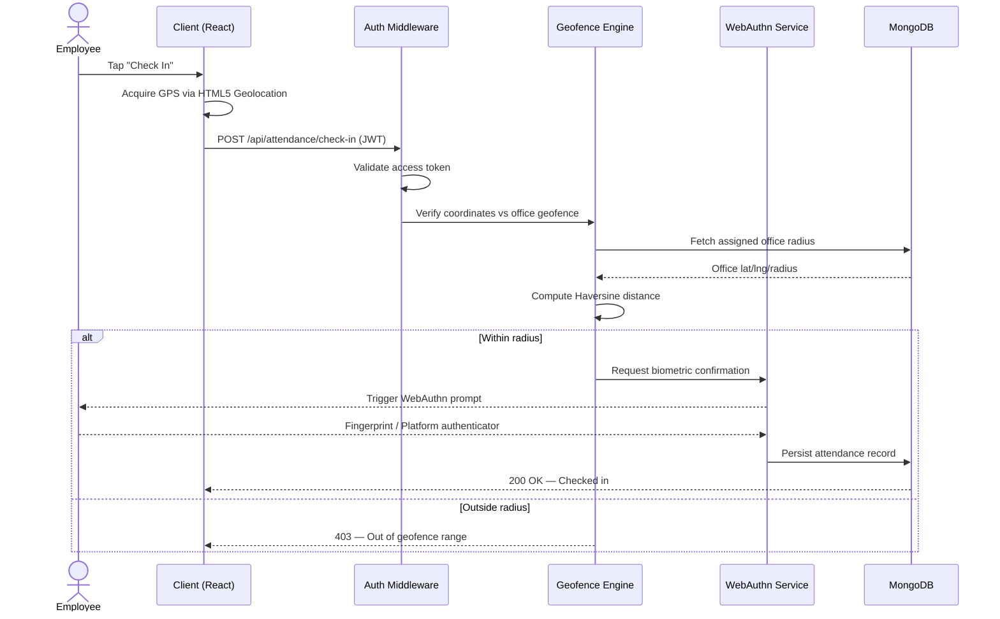
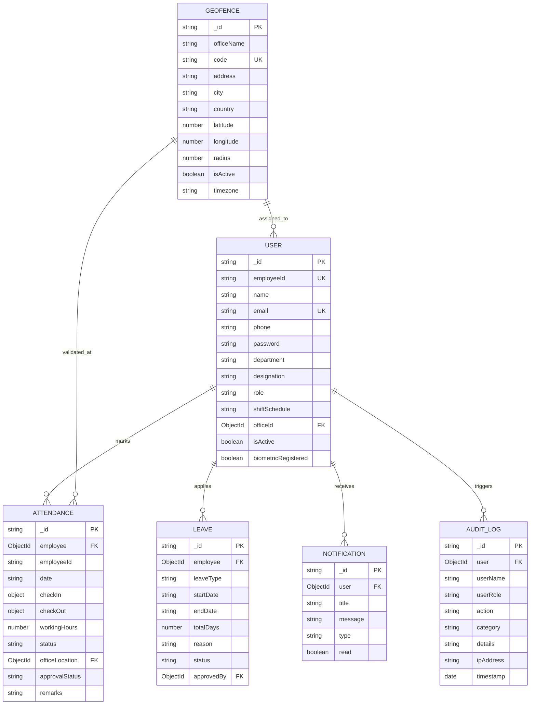
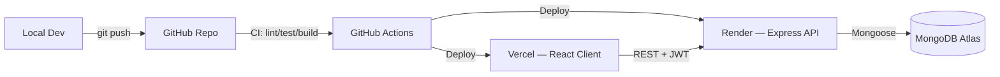

# 🌐 TrackZone
### Enterprise Geofencing & Biometric Attendance Platform

<p align="center">
  
  
  
  
  
</p>

<p align="center">
  
  
  
  
  
</p>

<p align="center">
  TrackZone eliminates proxy attendance through <b>dual-layer authentication</b>: high-precision spatial geofencing via the <b>Haversine formula</b> rendered on interactive Leaflet maps, combined with <b>WebAuthn FIDO2</b> biometric verification.
</p>

---

## 📑 Table of Contents

- [System Architecture](#-system-architecture)
- [Key Features](#-key-features)
- [Tech Stack](#-tech-stack)
- [Database ER Diagram](#-database-entity-relationship-er-diagram)
- [Haversine Geofencing Formula](#-haversine-geofencing-formula)
- [Quick Start](#-quick-start--setup)
- [Environment Variables](#-environment-variables)
- [API Reference](#-api-reference)
- [Project Structure](#-project-structure)
- [Demo Credentials](#-preloaded-demo-credentials)
- [Testing](#-testing)
- [Deployment](#-deployment)
- [Security Measures](#-security-measures)
- [Roadmap](#-roadmap)
- [Contributing](#-contributing)
- [License](#-license)

---

## 🏛️ System Architecture



### Request Lifecycle (Check-In Flow)



---

## 🚀 Key Features

### 👤 Employee Portal
- **Zero-Proxy Check-In / Check-Out** — Live GPS acquisition and Haversine distance verification against office geofences, with an interactive Leaflet map showing the live employee marker and office radius boundary.
- **Animated Biometric Modal** — WebAuthn FIDO2 fingerprint/platform authenticator flow with simulated hardware scanner feedback.
- **Attendance History & Timesheets** — Filterable audit log with status badges (Present, Late, Half-day, Absent), working-hours calculation, and 1-click PDF slip export.
- **Interactive Monthly Calendar** — Color-coded attendance calendar with per-date drill-down.
- **Leave Management** — Submit Paid / Sick / Casual / Emergency leave with real-time balance tracking.
- **Multi-Office Directory** — Browse all facilities, their coordinates, and perimeter radii.
- **Security & Profile** — Profile picture management, shift preferences, password rotation, hardware token status.

### 🛡️ Administrator Command Hub
- **Executive Analytics Dashboard** — Real-time KPIs (Total Staff, Present Today, Late Arrivals, Absent, Leaves, Avg. Daily Hours), 7-day trend area charts, department-wise adherence bar charts, and today's status donut chart (Recharts). Live stream of incoming punches with GPS + biometric signatures.
- **Employee Directory Management** — Full CRUD, department assignment, shift configuration, role management.
- **Spatial Geofence Manager** — Add/edit/remove facilities, drag coordinate pins or type lat/lng, dynamic perimeter slider with live map feedback.
- **Attendance Regularization & Overrides** — Review regularize requests, adjust hours, record auditor remarks.
- **Leave Approvals** — Approve/reject with comments.
- **Comprehensive Reports** — Tabulated monthly analytics with 1-click PDF and Excel (.xlsx) exports.
- **Immutable Audit Trail** — Chronological security logs with category, IP address, and user action.

---

## 🧰 Tech Stack

| Layer | Technology |
|---|---|
| **Frontend Framework** | React 18.3 + Vite + TypeScript 5.5 |
| **Styling** | Tailwind CSS, Glassmorphism design system |
| **State / Data Fetching** | React Context, TanStack Query |
| **Maps & Geolocation** | Leaflet.js, HTML5 Geolocation API |
| **Biometrics** | WebAuthn FIDO2 API |
| **Charts** | Recharts (Area / Bar / Donut) |
| **Exports** | jsPDF, SheetJS (XLSX) |
| **Backend Framework** | Node.js 20+, Express, TypeScript |
| **Database / ODM** | MongoDB Atlas, Mongoose |
| **Auth** | JWT (access + refresh tokens), bcrypt |
| **Security Middleware** | Helmet, CORS whitelisting, express-rate-limit |
| **CI/CD** | GitHub Actions → Vercel (client) + Render (server) |

---

## 🗄️ Database Entity Relationship (ER) Diagram



---

## 📐 Haversine Geofencing Formula

TrackZone uses the spherical Haversine formula to compute great-circle distances between GPS coordinates:

$$\Delta\phi = \frac{(\text{lat}_2 - \text{lat}_1) \cdot \pi}{180}, \quad \Delta\lambda = \frac{(\text{lon}_2 - \text{lon}_1) \cdot \pi}{180}$$

$$a = \sin^2\left(\frac{\Delta\phi}{2}\right) + \cos(\phi_1) \cdot \cos(\phi_2) \cdot \sin^2\left(\frac{\Delta\lambda}{2}\right)$$

$$c = 2 \cdot \text{atan2}\left(\sqrt{a}, \sqrt{1 - a}\right), \quad d = R \cdot c \quad (R = 6{,}371{,}000\text{ meters})$$

$$\text{Allow Attendance} \iff d \le (\text{Office Radius} + \text{Accuracy Tolerance})$$

> **Server-Side Enforcement:** distance is always recalculated on the backend using the raw coordinates submitted by the device — client-reported "inside geofence" flags are never trusted.

---

## ⚡ Quick Start & Setup

### Prerequisites

| Requirement | Minimum Version |
|---|---|
| Node.js | v18.0 (v20+ recommended) |
| npm | v9.0+ |
| MongoDB | Atlas URI or local instance |

### 1. Clone & Install

```bash
git clone https://github.com/<your-org>/trackzone.git
cd trackzone

# Backend
cd backend
npm install

# Frontend
cd ../frontend
npm install
```

### 2. Configure Environment

See [Environment Variables](#-environment-variables) below, then:

```bash
cp backend/.env.example backend/.env
cp frontend/.env.example frontend/.env
```

### 3. Run in Development

```bash
# Terminal 1 — Backend
cd backend
npm run dev
# → http://localhost:5000

# Terminal 2 — Frontend
cd frontend
npm run dev
# → http://localhost:5173
```

MongoDB automatically seeds sample offices, users, and demo attendance data on first boot.

### 4. Build for Production

```bash
cd backend && npm run build && npm start
cd frontend && npm run build && npm run preview
```

---

## 🔐 Environment Variables

`backend/.env`

```env
PORT=5000
NODE_ENV=development
MONGODB_URI=mongodb://localhost:27017/trackzone
JWT_SECRET=<generate-a-strong-random-secret>
JWT_REFRESH_SECRET=<generate-a-strong-random-secret>
JWT_EXPIRES_IN=1d
JWT_REFRESH_EXPIRES_IN=7d
CLIENT_URL=http://localhost:5173
DEFAULT_GEOFENCE_RADIUS=150
```

> ⚠️ **Never commit real secrets.** Generate strong values with `openssl rand -hex 32` and store them in your deployment platform's secret manager (Vercel/Render env vars, GitHub Actions secrets, etc.).

`frontend/.env`

```env
VITE_API_BASE_URL=http://localhost:5000/api
VITE_MAP_TILE_PROVIDER=openstreetmap
```

---

## 📡 API Reference

Full specs live in [`API_DOCUMENTATION.md`](./API_DOCUMENTATION.md). Summary of core endpoints:

| Method | Endpoint | Description | Auth |
|---|---|---|---|
| `POST` | `/api/auth/login` | Authenticate and issue JWT pair | Public |
| `POST` | `/api/auth/refresh` | Rotate access token | Refresh token |
| `POST` | `/api/attendance/check-in` | Geofence + biometric-gated check-in | Employee |
| `POST` | `/api/attendance/check-out` | Close active attendance session | Employee |
| `GET` | `/api/attendance/history` | Paginated attendance timesheet | Employee |
| `GET` | `/api/attendance/export/pdf` | Generate PDF attendance slip | Employee |
| `POST` | `/api/leave` | Submit leave application | Employee |
| `PATCH` | `/api/leave/:id/approve` | Approve/reject leave | Admin |
| `GET` | `/api/admin/dashboard` | Aggregated KPI + chart data | Admin |
| `POST` | `/api/geofence` | Create office geofence | Admin |
| `PATCH` | `/api/geofence/:id` | Update office coordinates/radius | Admin |
| `GET` | `/api/reports/export` | Excel/PDF monthly report export | Admin |
| `GET` | `/api/audit-logs` | Immutable security audit trail | Admin |

---

## 📁 Project Structure

```
trackzone/
├── backend/
│   ├── src/
│   │   ├── controllers/     # Attendance, Geofence, Admin, Leave, User
│   │   ├── middleware/      # Auth guard, RBAC, rate limiter, error handler
│   │   ├── models/          # Mongoose schemas
│   │   ├── services/        # Haversine engine, WebAuthn verification
│   │   ├── routes/
│   │   └── index.ts
│   ├── .env.example
│   └── package.json
├── frontend/
│   ├── src/
│   │   ├── components/      # Map, Charts, Modals, Tables
│   │   ├── pages/           # Employee & Admin route views
│   │   ├── context/         # Auth + global state
│   │   ├── hooks/
│   │   └── main.tsx
│   ├── .env.example
│   └── package.json
├── API_DOCUMENTATION.md
├── DEPLOYMENT_GUIDE.md
├── ER_DIAGRAM.md
└── README.md
```

---

## 🔑 Preloaded Demo Credentials

For instant evaluation, 1-click login buttons are provided on the login page:

| Role | Email | Password | Assigned Office |
|---|---|---|---|
| **Administrator** | `admin@trackzone.com` | `Admin@123` | TrackZone Tech Hub (Bangalore) |
| **Lead Engineer** | `sarah.chen@trackzone.com` | `Employee@123` | TrackZone Tech Hub (Bangalore) |
| **DevOps Architect** | `david.kumar@trackzone.com` | `Employee@123` | TrackZone Tech Hub (Bangalore) |
| **Head of HR** | `emma.watson@trackzone.com` | `Employee@123` | Silicon Valley Center (SF) |
| **Principal Designer** | `rachel.green@trackzone.com` | `Employee@123` | Manhattan Innovation Lab (NYC) |

> These accounts are seeded automatically in development. Disable or rotate them before any production deployment.

---

## 🧪 Testing

```bash
# Backend unit + integration tests
cd backend
npm run test
npm run test:coverage

# Frontend component tests
cd frontend
npm run test

# End-to-end (Playwright)
npm run test:e2e
```

Recommended CI gate before merge: lint → type-check → unit tests → build.

---

## ☁️ Deployment

TrackZone is designed for a **Vercel (frontend) + Render (backend) + MongoDB Atlas** topology, documented in full in [`DEPLOYMENT_GUIDE.md`](./DEPLOYMENT_GUIDE.md).



---

## 🔒 Security Measures

- **Password Security** — Salted bcrypt hashing (10 rounds).
- **Session Tokens** — Short-lived JWT access tokens + HTTP-safe refresh token exchange.
- **RBAC** — Multi-level role middleware isolating employee operations from admin capabilities.
- **HTTP Hardening** — Helmet security headers, CORS origin whitelisting, Express rate limiting.
- **Tamper Prevention** — GPS distance is recalculated server-side on every check-in; cannot be spoofed via client payloads.
- **Biometric Trust Boundary** — WebAuthn attestation validated server-side; no biometric raw data ever leaves the device.
- **Audit Immutability** — Audit log writes are append-only; no update/delete route exists for the collection.

---

## 🗺️ Roadmap

- [ ] Native mobile apps (React Native) with background geofence checks
- [ ] SSO / SAML integration for enterprise IdPs
- [ ] Configurable multi-radius (nested) geofences per office
- [ ] Shift-swap marketplace for employees
- [ ] Webhook events for external HRIS/payroll sync
- [ ] Offline check-in queue with sync-on-reconnect

---

## 🤝 Contributing

Contributions are welcome!

1. Fork the repository
2. Create a feature branch: `git checkout -b feature/your-feature`
3. Commit using [Conventional Commits](https://www.conventionalcommits.org/): `feat: add nested geofence support`
4. Push and open a Pull Request against `main`
5. Ensure `npm run lint`, `npm run test`, and `npm run build` all pass in CI

Please open an issue before starting large changes so the approach can be discussed first.

---

## 📄 License

Distributed under the **MIT License**. See [`LICENSE`](./LICENSE) for details.

---

<p align="center">Built with ❤️ for teams who are done with proxy attendance.</p>
