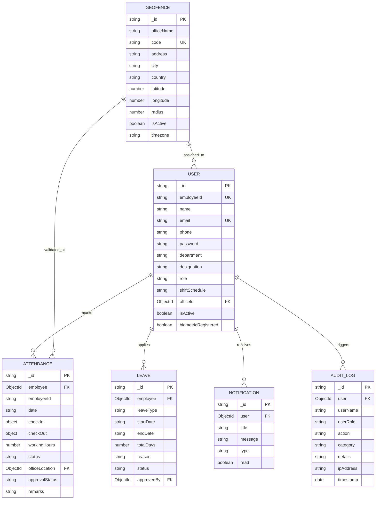

# 🌐 TrackZone — Enterprise Geofencing & Biometric Attendance System

[](https://github.com)
[](https://opensource.org/licenses/MIT)
[](https://www.typescriptlang.org/)
[](https://nodejs.org)
[](https://react.dev)

TrackZone is a smart, enterprise-grade attendance management platform that completely **eliminates proxy attendance** through dual-layer authentication:
1. **Real-time Spatial Geofencing** (computed via the high-precision **Haversine formula** and rendered interactively on Leaflet maps).
2. **Biometric Verification** (integrated with the **WebAuthn FIDO2 API** and high-fidelity simulated hardware scanners).

---

## 🏛️ System Architecture


---

## 🚀 Key Features

### 👤 Employee Portal
- **Zero-Proxy Check-In / Check-Out**:
  - Live GPS acquisition and Haversine distance verification against office geofences.
  - Interactive Leaflet map displaying real-time employee marker and office radius boundary circle.
  - Animated WebAuthn Biometric / Fingerprint authentication modal.
- **Attendance History & Timesheets**: Filterable audit log with status badges (Present, Late, Half-day, Absent), working hours calculation, and 1-click **PDF Slip Export**.
- **Interactive Monthly Calendar**: Visual color-coded attendance calendar with detailed date inspection.
- **Leave Management**: Submit leave applications (Paid, Sick, Casual, Emergency) with real-time balance tracking.
- **Multi-Office Directory**: Inspect all company facilities, coordinates, and perimeter radii.
- **Security & Profile**: Profile picture management, shift preferences, password updates, and hardware token status.

### 🛡️ Administrator Command Hub
- **Executive Analytics Dashboard**:
  - Real-time KPIs: Total Staff, Present Today, Late Arrivals, Absent, Leaves, and Average Daily Working Hours.
  - **Recharts Analytics**: 7-day attendance trends (Area Chart), Department-wise attendance adherence (Bar Chart), and Today's status ratio (Donut / Pie Chart).
  - Live stream of incoming punches with GPS and biometric signatures.
- **Employee Directory Management**: Full CRUD operations, department assignments, shift configurations, and role management.
- **Spatial Geofence Manager**:
  - Add / Edit / Remove office facilities.
  - Drag coordinate pins or type GPS latitude/longitude.
  - Dynamic perimeter slider adjusting radius in meters with live map feedback.
- **Attendance Regularization & Overrides**: Review employee regularize requests, adjust working hours, and record auditor remarks.
- **Leave Approvals**: Review pending leave requests and approve or reject with comments.
- **Comprehensive Reports**: Tabulated monthly timesheet analytics with 1-click **PDF** and **Excel (.xlsx)** exports.
- **Immutable Audit Trail**: Chronological security audit logs with categories, IP addresses, and user actions.

---

## 🗄️ Database Entity Relationship (ER) Diagram



---

## 📐 Haversine Geofencing Formula

TrackZone uses the spherical Haversine formula to compute great-circle distances between GPS coordinates:

$$\Delta\phi = \frac{(\text{lat}_2 - \text{lat}_1) \cdot \pi}{180}, \quad \Delta\lambda = \frac{(\text{lon}_2 - \text{lon}_1) \cdot \pi}{180}$$

$$a = \sin^2\left(\frac{\Delta\phi}{2}\right) + \cos(\phi_1) \cdot \cos(\phi_2) \cdot \sin^2\left(\frac{\Delta\lambda}{2}\right)$$

$$c = 2 \cdot \text{atan2}\left(\sqrt{a}, \sqrt{1 - a}\right), \quad d = R \cdot c \quad (R = 6,371,000\text{ meters})$$

$$\text{Allow Attendance} \iff d \le (\text{Office Radius} + \text{Accuracy Tolerance})$$

---

## ⚡ Quick Start & Setup

### Prerequisites
- **Node.js**: v18.0 or higher
- **npm**: v9.0 or higher
- **MongoDB**: MongoDB Atlas connection URI or local MongoDB instance (TrackZone automatically initializes sample seed data!)

### 1. Installation
```bash
# Clone or navigate to the Trackzone directory
cd Trackzone

# Install Backend dependencies
cd backend
npm install

# Install Frontend dependencies
cd ../frontend
npm install
```

### 2. Environment Configuration
Backend `.env` configuration file (`backend/.env`):
```env
PORT=5000
NODE_ENV=development
MONGODB_URI=mongodb://localhost:27017/trackzone
JWT_SECRET=trackzone_enterprise_super_secret_jwt_key_2026_x89f
JWT_REFRESH_SECRET=trackzone_refresh_super_secret_jwt_key_2026_k49z
JWT_EXPIRES_IN=1d
JWT_REFRESH_EXPIRES_IN=7d
CLIENT_URL=http://localhost:5173
DEFAULT_GEOFENCE_RADIUS=150
```

### 3. Start Development Servers

**Run Backend:**
```bash
cd backend
npm run dev
# Server running at http://localhost:5000
```

**Run Frontend:**
```bash
cd frontend
npm run dev
# Client running at http://localhost:5173
```

---

## 🔑 Preloaded Demo Credentials

For instant evaluation, 1-click login buttons are provided on the login page:

| Role | Email | Password | Assigned Office |
|---|---|---|---|
| **Administrator** | `admin@trackzone.com` | `Admin@123` | TrackZone Tech Hub (Bangalore) |
| **Lead Engineer** | `sarah.chen@trackzone.com` | `Employee@123` | TrackZone Tech Hub (Bangalore) |
| **DevOps Architect** | `david.kumar@trackzone.com` | `Employee@123` | TrackZone Tech Hub (Bangalore) |
| **Head of HR** | `emma.watson@trackzone.com` | `Employee@123` | Silicon Valley Center (SF) |
| **Principal Designer** | `rachel.green@trackzone.com` | `Employee@123` | Manhattan Innovation Lab (NYC) |

---

## 📜 Documentation Index
- [REST API Specifications](file:///c:/Users/vijay/OneDrive/Desktop/Trackzone/API_DOCUMENTATION.md)
- [Production Deployment Guide (Vercel + Render + Atlas)](file:///c:/Users/vijay/OneDrive/Desktop/Trackzone/DEPLOYMENT_GUIDE.md)
- [Database Schema & ER Diagrams](file:///c:/Users/vijay/OneDrive/Desktop/Trackzone/ER_DIAGRAM.md)

---

## 🔒 Security Measures
- **Password Security**: Salted bcrypt password hashing (10 rounds).
- **Session Tokens**: Short-lived JWT access tokens + HTTP-safe refresh token exchange.
- **RBAC**: Multi-level role middleware isolating employee operations from admin capabilities.
- **HTTP Hardening**: Helmet security headers, CORS origin whitelisting, Express rate limiting.
- **Tamper Prevention**: GPS distance re-calculated server-side on every check-in request; cannot be faked via client payloads.
